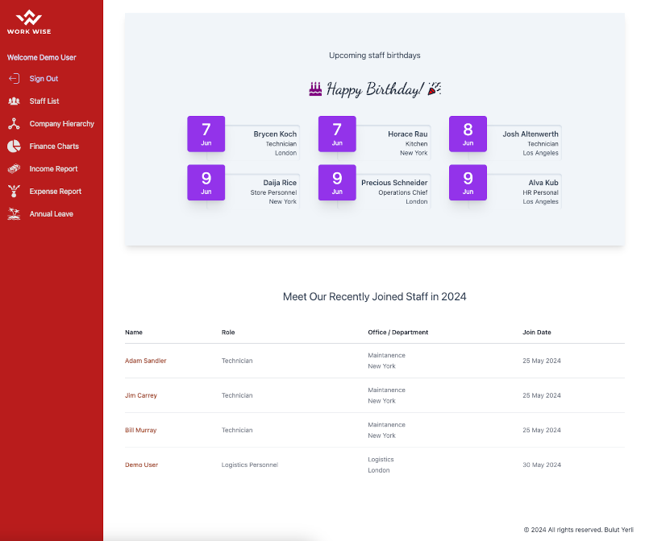

# Workwise Backend

Workwise Backend is the backend application for the Workwise project. It provides the necessary APIs and services to support the Workwise web application.

[Live Demo](https://work-wisee.vercel.app/)



## Table of Contents

- [Workwise Backend](#workwise-backend)
  - [Table of Contents](#table-of-contents)
  - [Features](#features)
  - [Technologies Used](#technologies-used)
  - [Installation](#installation)

## Features

- Staff list and staff details of company.
- Financial and hiearchy charts.
- Expense and income detail tables.
- Annual leave request and approval pages. (Only relavent managers can see and approve requests)
- Add, delete or edit staff. (only HR role can do these)

## Technologies Used

- Node.js
- Express.js
- TypeScript
- PostgreSQL
- Firebase Admin SDK
- Kysely

## Installation

1. **Clone the repository**:

   ```bash
   git clone https://github.com/your-username/workwise-backend.git
   cd workwise-backend
   ```

2. **Install dependencies:**

   ```bash
   npm install
   ```

3. **Set up environment variables:**

   ```
   NODE_ENV=development
   DB_DATABASE=DATABASE-NAME
   PORT=8080
   DB_HOST=YOUR_DB_HOST
   DB_USER=YOUR_DB_USER
   DB_PASSWORD=YOUR_DB_PASSWORD
   DB_PORT=YOUR_DB_PORT
   BASE_URL=FRONTEND_URL
   GOOGLE_APPLICATION_CREDENTIALS=FIREBASE_ADMIN_SDK_SECRET_FILE
   ```

4. **Build and Start**:

   ```bash
   npm run build
   npm run start
   ```
